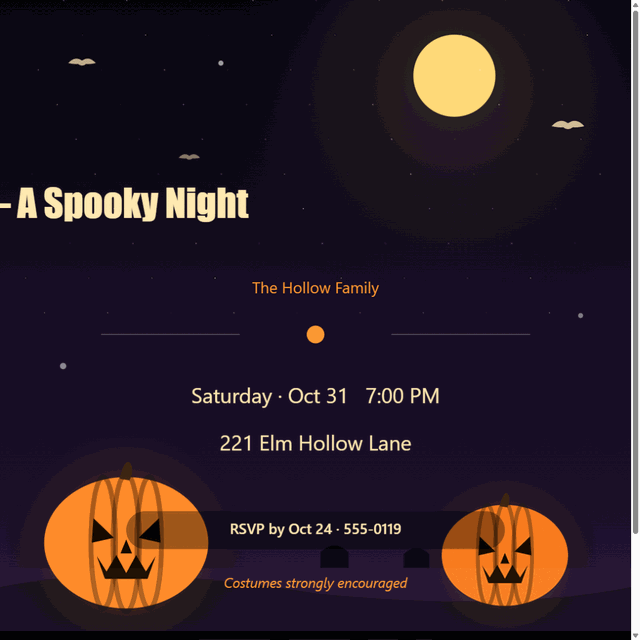
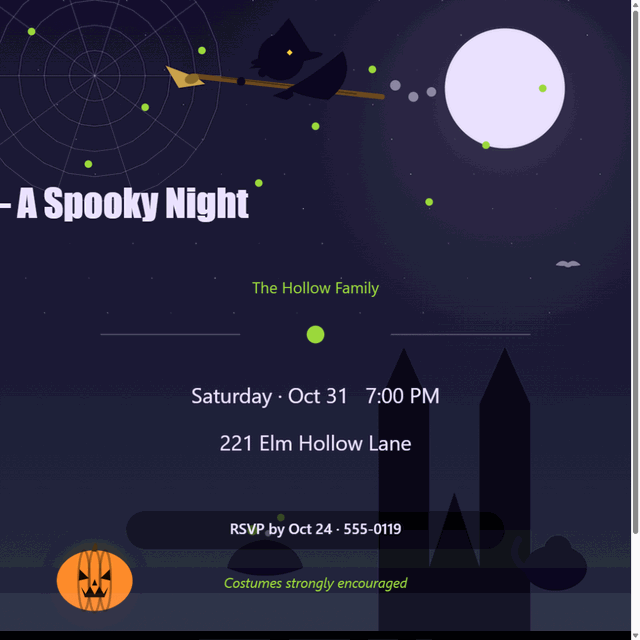
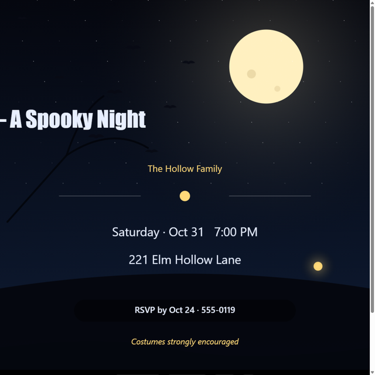
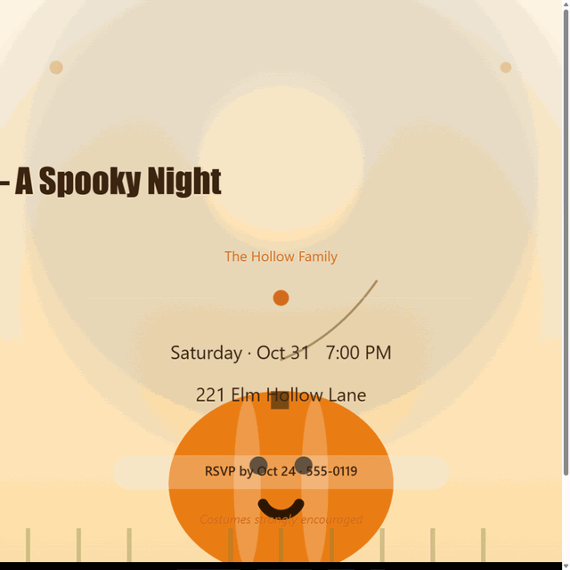
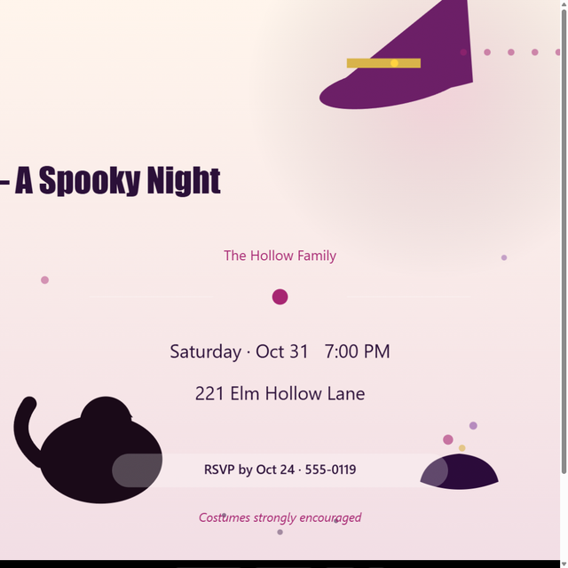
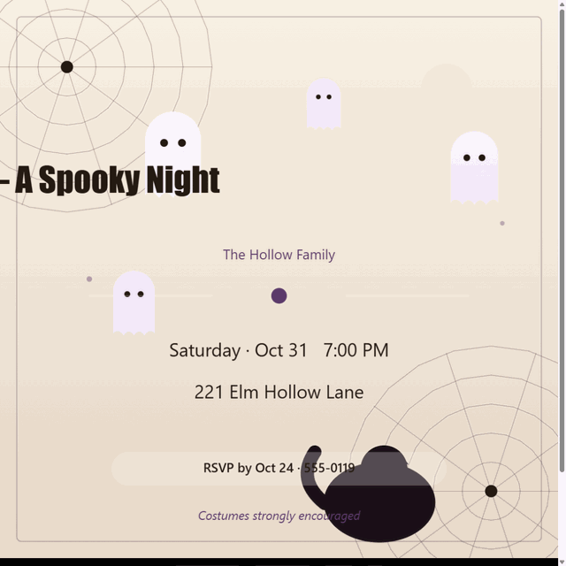

# TrendSnap — Free Seasonal Tools in Your Browser

**Spooky season is close.** Make a Halloween party invitation your guests will actually screenshot — in your browser, in about a minute, for free.

🎃 **Open the maker now:** **https://aiharryone.github.io/trendsnap/halloween-invite.html**

## 🎃 Halloween Invitation Maker

Pick one of **25 hand-drawn illustrated templates — 5 of them animated**, type your party details, and export a share-ready invitation (PNG, or looping GIF for the animated ones). Everything is rendered on a `<canvas>` in your browser — **nothing is uploaded, there is no account, and it's 100% free.**

| | | |
|---|---|---|
|  |  |  |
|  |  |  |

*6 of 25 templates — see all of them (5 animated ✨) in the [maker](https://aiharryone.github.io/trendsnap/halloween-invite.html).*

### What you get

- 🎨 **25 hand-drawn templates — 5 animated** ✨: flickering jack-o'-lantern, floating ghosts, bubbling cauldron, shooting stars, swaying candlelight
- 🎞 **Animated GIF export** — the animated templates export as a looping GIF; all templates export still PNG
- ⚡ **Live preview** — edit the title, date, time and place; the card updates as you type
- 📐 **3 export sizes** — 1:1 for feed posts, 9:16 for stories, 5×7 for printing
- 📲 **One-click share** — native share sheet on mobile, download on desktop
- 🔒 **Private by design** — drawn locally on canvas; your party details never leave your device

## 🛠️ How it works

No build step, no framework, no backend. Plain HTML + vanilla JavaScript + the Canvas API. Open the page, edit, export — it works offline once loaded, and works the same on a phone.

## ❓ FAQ

<b>Is it really free?</b>

Yes — every template, every export size, no watermark on the Halloween maker, no signup.

<b>Do you store my invitation or party details?</b>

No. The card is drawn locally on your device's canvas. Nothing is uploaded to any server.

<b>Can I print the invitation?</b>

Yes — export the 5×7 print size and it comes out crisp at standard invitation dimensions.

<b>Are more events coming?</b>

Yes — TrendSnap adds a small batch of tools for each big seasonal moment. Thanksgiving and Christmas sets are next.

---

## 🧰 More free browser tools from the same maker

- **[KDP Launch Kit](https://aiharryone.github.io/kdp-launch-kit/)** — royalty calculator, keyword tools & listing generator for Amazon KDP authors
- **[PixelFix](https://aiharryone.github.io/pixelfix/)** — fix, convert, compress and restore photos without uploading them
- **[Certificate Maker](https://aiharryone.github.io/certificate-maker/)** — 26 printable certificate templates for awards, courses and recognition

---

*Made for spooky season 2026. If it saved you a Canva trial, consider sharing it with someone who's planning a Halloween party. 🎃*
